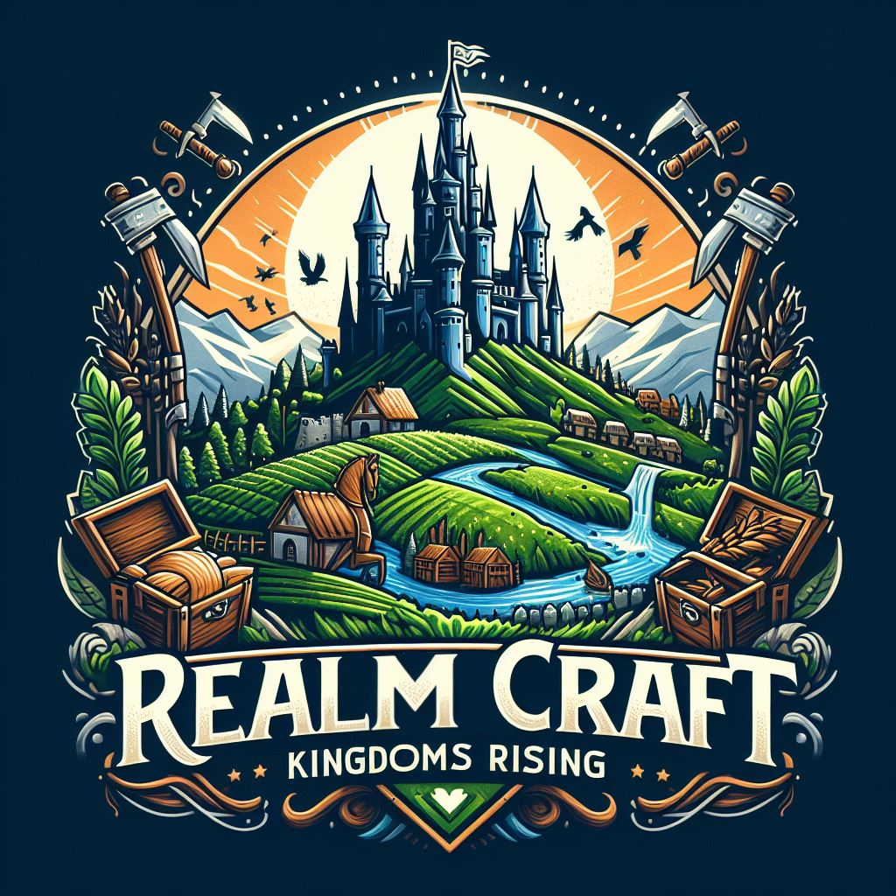

# Crafting Kingdoms



Welcome to the official repository of Crafting Kingdoms, an idle Web3 browser game set in a rich medieval world. Here you can build towns, manage your empire, and battle for glory!

## Table of Contents

- [Introduction](#introduction)
- [Game Features](#game-features)
- [Technologies](#technologies)
- [Getting Started](#getting-started)
- [Documentation](#documentation)
- [Contributing](#contributing)
- [License](#license)

## Introduction

**Crafting Kingdoms** offers players a unique blend of strategic planning and RPG adventures, all integrated with blockchain technology for a secure, immersive gaming experience. Build your towns, upgrade workshops, hire workforce, and assemble armies to explore dungeons or wage wars against other realms.

## Game Features

- **Build and Manage Towns**: Start from a humble village and expand into a sprawling kingdom.
- **Workshop Management**: Upgrade and manage workshops to boost your town's productivity.
- **Hire and Train Workers**: Employ skilled workers and warriors to grow your economy and fortify your defenses.
- **Explore Dungeons**: Send expeditions to explore mysterious dungeons and uncover hidden treasures.
- **Real-time Battles**: Engage in real-time combat with other players to test your strategic skills.
- **Blockchain Integration**: Experience true ownership of in-game assets, secure transactions, and a vibrant player economy.

## Technologies

Crafting Kingdoms is built using modern web technologies:

- **Next.js** for robust server-side rendering and static generation.
- **ThirdWeb API** for seamless Web3 integrations.
- **TypeScript** for type-safe code and scalability.
- **Modular CSS** for responsive and maintainable styles.

## Getting Started

To get started with Crafting Kingdoms:

1. Clone the repository:
   ```bash
   git clone https://github.com/yourusername/craftingkingdoms.git
   ```
2. Install dependencies:

   ```bash
   Copy code
   npm install
   ```

3. Start the development server:
   ```bash
   Copy code
   npm run dev
   ```

## Documentation

For detailed information on gameplay mechanics, technology stack, and development, visit our Documentation Page.

## Contributing

Interested in contributing to Crafting Kingdoms? Please read our Contributing Guidelines for details on our code of conduct and the process for submitting pull requests.

## License

Crafting Kingdoms is privately licensed. Use and distribution are subject to the terms specified in the LICENSE file.

<br />

---
### Craft your kingdom, command your armies, and conquer the realm!
